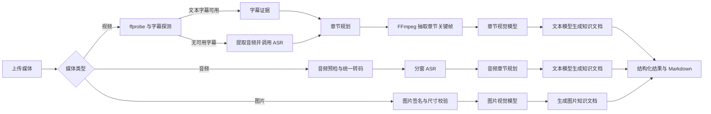

# Media to Knowledge

一个基于 Python 3.11、FastAPI 和 SQLAlchemy 的本地多媒体理解项目。它接收视频、音频或图片，经过媒体探测、语音识别、章节规划和视觉理解，最终生成结构化结果与 Markdown 知识文档。

项目面向本地演示、媒体理解链路验证和质量评测。上传文件、SQLite 数据库、模型响应快照及生成结果均保存在工作区内，不依赖远端数据库，也不会建立向量索引。

## 核心能力

| 输入 | 支持格式 | 主要处理 | 输出 |
| --- | --- | --- | --- |
| 视频 | MP4、MOV、MKV、WebM | 字幕提取或云端 ASR、章节规划、关键帧抽取、章节 VLM、文本写作 | Markdown 文档、结构化结果、可追溯证据 |
| 音频 | MP3、WAV、M4A、AAC、OGG、FLAC、WebM | 音频预检、统一转码、分窗 ASR、章节规划、文本写作 | Markdown 文档、摘要、章节与语音证据 |
| 图片 | JPEG、PNG、WebP | 文件校验、图片 VLM、内容与事实整理 | Markdown 文档、结构化图片理解结果 |

项目还提供以下工程能力：

- 基于幂等键、可靠任务、取消、重试和进程重启恢复的异步处理。
- 严格校验扩展名、声明 MIME、文件签名、文件大小和 SHA-256。
- 视频、音频和图片分别使用独立阶段调度器，避免不同媒体链路互相串线。
- 通过租约、写入围栏和原子发布避免重复任务或旧执行器覆盖新结果。
- 使用本地 SQLite 和 Alembic 管理运行状态及数据库迁移。
- 对模型输入、输出体积、关键帧数量、运行目录和符号链接设置安全边界。
- 提供自动化质量评测、人工 rubric、耐久测试和稳定退出码。

## 处理流程



### 视频链路

视频文本解析遵循“内嵌文本字幕优先，云端 ASR 兜底”的顺序。系统通过 `ffprobe` 查找字幕流，只解析 `subrip`、`ass`、`ssa`、`webvtt` 和 `mov_text` 文本字幕。字幕通过 UTF-8、大小、时间轴、cue 数量和启发式完整性校验后，将直接作为 `SUBTITLE_CUE` 证据，不再提取音频或调用 ASR。

PGS、DVD Subtitle 等位图字幕，以及直接烧录在画面中的字幕，目前不会被当作文本字幕识别。字幕不存在、解码失败或完整性不足时，系统会提取单声道 16 kHz MP3，并按固定十分钟窗口串行调用云端 ASR。

获得语音文本后，系统根据语义锚点与章节中点确定抽帧时间，使用 FFmpeg 生成本地 JPEG，再把每章 2～4 张授权图片交给视觉模型。文本模型结合语音证据与视觉观察生成最终 Markdown 文档。

### 音频链路

音频上传保持多格式兼容，进入生产链路后统一转换为 `audio/mpeg`、单声道、16 kHz 的 MP3。编码请求为 192 kbps CBR；受 MPEG Layer III 标准限制，16 kHz 文件被 `ffprobe` 检测为约 160 kbps 属正常现象。

音频链路只执行音频预检、分窗 ASR、音频章节规划和音频章节写作，不进入视频探测、关键帧或视觉阶段。单个 Run 内的 ASR 窗口严格串行，窗口完成后立即保存快照；重试时只处理尚未成功的窗口。

### 图片链路

图片链路支持 JPEG、PNG 和 WebP。上传时会同时校验扩展名、MIME 和二进制签名，随后调用图片视觉模型生成标题、概述、内容块、事实主张和证据引用。图片不会进入语音或视频阶段。

## 技术栈

- Python 3.11
- FastAPI + Uvicorn
- Pydantic v2 + pydantic-settings
- SQLAlchemy 2 + Alembic + SQLite
- HTTPX
- FFmpeg + ffprobe
- pytest、Ruff、mypy
- OpenAI 兼容的 ASR、文本 LLM 和视觉 VLM 接口

## 环境要求

- macOS 或 Linux。本地数据库迁移依赖文件锁，不支持 Windows。
- Python `>=3.11,<3.12`。
- 已安装 [uv](https://docs.astral.sh/uv/)。
- 可用的 FFmpeg 和 ffprobe。
- 三套完整的模型配置：云端 ASR、文本 LLM、视觉 VLM。

## 快速开始

### 1. 克隆并安装依赖

```bash
git clone https://github.com/lywnl/media-to-knowledge.git
cd media-to-knowledge
uv sync --extra dev
```

需要运行历史语音质量评测或完整评测工具时，再安装可选依赖：

```bash
uv sync --extra dev --extra speech --extra evaluation
```

### 2. 准备 FFmpeg

默认情况下，程序从以下工作区内部路径读取二进制文件：

```text
.codex/video-rag-demo/tools/ffmpeg
.codex/video-rag-demo/tools/ffprobe
```

可以把系统已安装的二进制复制到默认位置：

```bash
mkdir -p .codex/video-rag-demo/tools
cp "$(command -v ffmpeg)" .codex/video-rag-demo/tools/ffmpeg
cp "$(command -v ffprobe)" .codex/video-rag-demo/tools/ffprobe
```

也可以在 `.env` 中通过 `VIDEO_DEMO_FFMPEG_PATH` 和 `VIDEO_DEMO_FFPROBE_PATH` 指定其他路径，但目标仍必须位于当前项目工作区内。

### 3. 配置模型

复制环境变量示例：

```bash
cp .env.example .env
```

至少填写以下配置：

```dotenv
# 文本模型
VIDEO_DEMO_TEXT_LLM_BASE_URL=https://your-text-model.example/v1
VIDEO_DEMO_TEXT_LLM_API_KEY=
VIDEO_DEMO_TEXT_LLM_MODEL_ID=your-text-model

# 章节视觉模型
VIDEO_DEMO_VLM_BASE_URL=https://your-vision-model.example/v1
VIDEO_DEMO_VLM_API_KEY=
VIDEO_DEMO_VLM_MODEL_ID=your-vision-model

# OpenAI 兼容语音识别
OPENAI_BASE_URL=https://your-asr-provider.example/v1
OPENAI_API_KEY=
OPENAI_MODEL=your-whisper-model
```

三组配置的 Base URL 都必须使用 HTTPS。`OPENAI_BASE_URL` 应填写 OpenAI 兼容的 `/v1` 根路径，客户端会自行追加 `/audio/transcriptions`，不要直接填写完整转写端点。

真实密钥只能写入本地 `.env` 或进程环境变量。`.env` 已被 Git 忽略，不要把密钥写入 `.env.example`、测试、日志、截图或提交记录。

### 4. 启动服务

```bash
.venv/bin/video-demo-api
```

默认地址：

- 操作页面：<http://127.0.0.1:7999/>
- OpenAPI 文档：<http://127.0.0.1:7999/docs>
- OpenAPI JSON：<http://127.0.0.1:7999/openapi.json>

也可以直接使用 Uvicorn：

```bash
.venv/bin/uvicorn video_demo.main:app --host 127.0.0.1 --port 7999
```

## 使用方式

### 浏览器操作

打开 <http://127.0.0.1:7999/>，选择一个本地视频、音频或图片并开始处理。页面会自动执行上传、创建异步 Run、查询状态和展示 Markdown 文档。

演示页面固定使用以下本地作用域：

```text
tenant_id      = tenant-demo
application_id = app-demo
kb_id          = kb-demo
```

### API 调用

所有知识库媒体接口都要求两个请求头和一个路径参数：

```text
X-Tenant-Id: tenant-demo
X-Application-Id: app-demo
kb_id: kb-demo
```

以下示例上传一个 MP4 视频：

```bash
curl --fail-with-body \
  -X POST "http://127.0.0.1:7999/api/kb/knowledge-bases/kb-demo/video-objects" \
  -H "X-Tenant-Id: tenant-demo" \
  -H "X-Application-Id: app-demo" \
  -F "file=@./example.mp4;type=video/mp4"
```

响应中的 `object_ref` 用于创建理解任务：

```bash
curl --fail-with-body \
  -X POST "http://127.0.0.1:7999/api/kb/knowledge-bases/kb-demo/video-understanding-runs" \
  -H "X-Tenant-Id: tenant-demo" \
  -H "X-Application-Id: app-demo" \
  -H "Content-Type: application/json" \
  -d '{
    "object_ref": "obj_替换为上传接口返回值",
    "idempotency_key": "video-demo-request-0001",
    "language_hints": ["zh"],
    "hotwords": ["FastAPI", "SQLAlchemy"],
    "core_context": "这是一个技术演示视频",
    "result_schema_version": "4.2.0"
  }'
```

创建接口返回 `run_id` 和 `job_id`。任务是异步执行的，可查询状态并在成功后获取文档：

```bash
RUN_ID="替换为创建接口返回值"
RUN_ROOT="http://127.0.0.1:7999/api/kb/knowledge-bases/kb-demo/video-understanding-runs/$RUN_ID"

curl --fail-with-body \
  -H "X-Tenant-Id: tenant-demo" \
  -H "X-Application-Id: app-demo" \
  "$RUN_ROOT"

curl --fail-with-body \
  -H "X-Tenant-Id: tenant-demo" \
  -H "X-Application-Id: app-demo" \
  "$RUN_ROOT/document"
```

主要接口如下：

| 操作 | 视频 | 音频 | 图片 |
| --- | --- | --- | --- |
| 上传 | `/video-objects` | `/audio-objects` | `/image-objects` |
| 创建 Run | `/video-understanding-runs` | `/audio-understanding-runs` | `/image-understanding-runs` |
| 查询 Run | `/{run_id}` | `/{run_id}` | `/{run_id}` |
| 获取结果 | `/{run_id}/result` | `/{run_id}/result` | `/{run_id}/result` |
| 获取文档 | `/{run_id}/document` | `/{run_id}/document` | `/{run_id}/document` |

表中路径均接在 `/api/kb/knowledge-bases/{kb_id}` 后。视频还提供分页证据接口 `/{run_id}/evidence` 和关键帧内容接口 `/{run_id}/keyframes/{keyframe_id}/content`，主要用于内部验证和诊断。

任务状态包括：`PENDING`、`RUNNING`、`SUCCEEDED`、`PARTIAL_SUCCEEDED`、`FAILED` 和 `CANCELLED`。对同一资源重试相同请求时应复用原 `idempotency_key`；修改输入参数后必须使用新的 key。

## 本地数据与安全边界

默认运行目录为：

```text
.codex/video-rag-demo/
```

其中包含上传对象、运行输入、可恢复快照、关键帧、Markdown 文档、评测文件和 `video-demo.db`。数据库是本地 SQLite 文件，生产启动路径明确拒绝远端数据库 URL，也要求数据库位于运行目录内部。

“本地存储”不等于“完全离线处理”。当对应链路启用时，程序会把 ASR 音频窗口、文本模型所需的转写与视觉观察，以及 VLM 所需的章节 JPEG 发送到 `.env` 中配置的外部模型端点。使用真实媒体前，应先确认模型供应商的数据保留、隐私和合规策略。

以下内容已通过 `.gitignore` 排除：

- `.env` 和真实模型凭据
- `.codex/` 下的运行数据、评测数据、日志和本地备份
- `.superpowers/sdd/` 下的本地任务进度
- SQLite、WAL 和 SHM 文件
- Python 虚拟环境和测试缓存

不要将 `.codex/` 中的媒体、转写、模型响应、评测结果或历史备份手动强制加入 Git。

## 项目结构

```text
.
├── migrations/                 # Alembic 数据库迁移
├── src/video_demo/
│   ├── api/                    # FastAPI 路由、请求与响应模型
│   ├── application/            # 视频、音频、图片用例和阶段调度
│   ├── domain/                 # 领域模型与稳定契约
│   ├── evaluation/             # 质量、耐久和最终门禁
│   ├── integrations/           # ASR、文本 LLM、视觉 VLM 客户端
│   ├── media/                  # ffprobe、FFmpeg、字幕与媒体处理
│   ├── persistence/            # SQLAlchemy 仓储和迁移保护
│   ├── speech/                 # ASR 分窗、快照与语言处理
│   ├── storage/                # 本地对象、制品和快照存储
│   ├── visual/                 # 抽帧与关键帧制品
│   └── web/                    # 本地演示页面
├── tests/                      # 单元、契约、集成和端到端测试
├── .env.example                # 不含真实密钥的配置模板
├── alembic.ini
└── pyproject.toml
```

## 开发与测试

运行完整测试：

```bash
.venv/bin/pytest
```

运行静态检查：

```bash
.venv/bin/ruff check src tests
.venv/bin/mypy src
```

部分集成、质量和耐久测试需要本地二进制、外部模型或授权媒体。缺少前置条件时，相关质量结论必须是 `NOT_RUN` 或 `INCONCLUSIVE`，不能使用 mock、短视频循环或配置测试冒充真实质量通过。

## 评测 CLI

所有评测入口统一由 `video_demo.evaluation.cli` 提供：

```bash
EVALUATION_RUN_ID=eval_local_001

.venv/bin/python -m video_demo.evaluation.cli preflight --evaluation-run-id "$EVALUATION_RUN_ID"
.venv/bin/python -m video_demo.evaluation.cli media --evaluation-run-id "$EVALUATION_RUN_ID"
.venv/bin/python -m video_demo.evaluation.cli live --evaluation-run-id "$EVALUATION_RUN_ID"
.venv/bin/python -m video_demo.evaluation.cli quality predict --evaluation-run-id "$EVALUATION_RUN_ID"
.venv/bin/python -m video_demo.evaluation.cli quality score --evaluation-run-id "$EVALUATION_RUN_ID"
.venv/bin/python -m video_demo.evaluation.cli durability --evaluation-run-id "$EVALUATION_RUN_ID"
.venv/bin/python -m video_demo.evaluation.cli final --evaluation-run-id "$EVALUATION_RUN_ID"
```

退出码保持稳定：

| 退出码 | 含义 |
| --- | --- |
| `0` | 所有可执行检查均通过 |
| `1` | 至少存在一个 `FAIL` |
| `2` | 没有 `FAIL`，但存在 `NOT_RUN` |
| `3` | 评测配置或证据损坏 |

`quality predict` 通过真实产品 API 生成预测；`quality score` 读取绑定的人工判断并重新计算指标，评分阶段不会调用模型。视觉文字准确率、关键字段召回率、标题和摘要相关性、重复或冲突判断必须来自授权样本和完整人工 rubric。

清理单次评测运行是显式破坏性操作：

```bash
.venv/bin/python -m video_demo.evaluation.cli cleanup --evaluation-run-id "$EVALUATION_RUN_ID"
```

执行前应确认 `EVALUATION_RUN_ID` 指向目标运行。存在证据损坏、符号链接或活跃标记时，清理会拒绝执行。

## 当前限制

- 这是本地 Demo，不包含登录、权限后台、分布式部署或远端数据库。
- 不生成 RAG 检索文本，不建立向量索引，也不提供问答检索服务。
- ASR 不执行说话人分离、词级对齐或音频事件识别。
- 位图字幕和烧录字幕不会被解析成文本字幕。
- 视觉模型可能误读画面中的文字、代码、数字和界面状态；Schema 合法不代表内容准确。
- 旧 Schema Run 不会自动转换为当前 Schema `4.2.0`，升级后需要重新创建 Run。
- 正式五语 ASR、代表性视觉质量、人工文档 rubric 和两小时耐久必须使用有授权的真实素材单独验证。

## 常见问题

### 服务可以启动，但任务立即失败

先检查 `.env` 中的 ASR、文本 LLM 和视觉 VLM 是否成组配置完整，再检查 `.codex/video-rag-demo/tools/` 下是否存在可执行的 `ffmpeg` 与 `ffprobe`。模型端点缺失、部分配置或使用非 HTTPS URL 都会被拒绝。

### 视频存在字幕轨，为什么仍调用 ASR

探测到字幕轨不等于字幕可用。位图字幕、无法解码的字幕、时间轴异常或完整性不足的文本字幕都会触发 ASR 兜底。

### 为什么任务一直显示 PENDING 或 RUNNING

模型请求和长媒体处理可能耗时。先通过 Run 状态查看 `current_stage`，再查看本机服务日志。进程重启后，调度器会恢复可恢复任务；不可重试错误会稳定进入 `FAILED`，不会用空结果伪装成功。

### 数据是否会写入远端数据库

不会。数据库固定为工作区运行目录中的 SQLite 文件，原始上传对象也不会被发送到远端对象存储。但 ASR、文本 LLM 和视觉 VLM 会把完成推理所需的音频切片、文本或图片发送到显式配置的外部模型端点。

## License

项目元数据当前声明为 `Proprietary`。未经许可，不应将代码或素材用于再分发。
